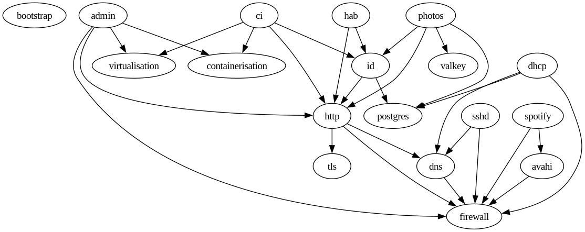

# Home Lab Server

Ansible scripts to deploy the homelab services at matbooth.co.uk.

## Pre-requisites

Clevis is used for automatic boot-time decryption of LUKS encrypted volumes, which requires a Tang server to be running elsewhere on the local network. Installation process for that is as follows:

```
# dnf install tang
# semanage port -a -t tangd_port_t -p tcp 7500
# firewall-cmd --zone=libvirt --add-port=7500/tcp
# cat <<EOF | sudo tee -a /etc/systemd/system/tangd.socket.d/override.conf
[Socket]
ListenStream=
ListenStream=7500
EOF
# systemctl daemon-reload
# systemctl enable --now tangd.socket
```

## First Run

```
$ ./run.sh        # Staging VM
$ PROD=1 ./run.sh # Real hardware
```

If a machine has not yet been provisioned, the script will provision a VM (staging) or boot USB stick to be used on real hardware (production).

Once provisioned, a bootstrap playbook will be executed to configure fundamentals like network adapters, user accounts, public key authentication, LUKS decryption, etc.

## Subsequent Runs

```
$ ./run.sh        # Staging VM
$ PROD=1 ./run.sh # Real hardware
```

Subsequent runs will execute the main playbooks to install and configure all the services. Provisioning and bootstrapping will be skipped.

## Roles

Applications and services accessible over the public internet:

* id - Keycloak instance for user management and SSO service for other apps
* photos - Immich for photo and video management
* ci - Jenkins for on-prem continuous integration
* sshd - SSH for restricted user shell accounts

Applications and services accessible over the local network only:

* admin - Cockpit for system administration and monitoring
* hab - OpenHAB for home automation
* spotify - Spotifyd for local users of Spotify to play music through the big stereo

### Dependencies

This dependency graph show roughly how the roles all hang together:


